# Hierarchical Memory Middleware

**A middleware system that enables infinite AI agent conversations through intelligent hierarchical compression and MCP-based memory browsing.**

## Overview

The Hierarchical Memory Middleware solves the fundamental problem of context window limitations in AI conversations. Instead of truncating or losing conversation history, it implements a sophisticated 4-level hierarchical compression system that preserves the ability to access any previous conversation detail while maintaining optimal performance.

## Key Features

- **🧠 Infinite Conversations**: Break free from context window limitations through intelligent compression
- **🔍 Perfect Recall**: Access any historical conversation detail via MCP memory tools
- **⚡ Optimal Performance**: Hierarchical compression maintains fast response times
- **🔌 Multi-Model Support**: Works with Anthropic Claude, OpenAI GPT, Google Gemini, Moonshot, DeepSeek, and more
- **🛠️ MCP Integration**: Built-in Model Context Protocol server for seamless memory browsing
- **💾 Persistent Storage**: DuckDB-based storage with full conversation history
- **🔍 Advanced Search**: Full-text and regex search across conversation history

## Performance at Scale

See the dramatic efficiency gains through intelligent compression:


*🔴 Traditional approach hits context limits quickly • 🟢 Hierarchical Memory scales infinitely*

## Architecture

### Core Components

1. **Conversation Manager** (`HierarchicalConversationManager`)
   - Orchestrates conversations with PydanticAI agents
   - Manages compression triggers and memory integration
   - Handles tool call tracking and message reconstruction

2. **Storage Layer** (`DuckDBStorage`)
   - Persistent storage using DuckDB for high performance
   - Stores conversation nodes with metadata, compression levels, and AI components
   - Provides efficient querying and search capabilities

3. **Hierarchical Compression System** (`AdvancedCompressionManager`)
   - 4-level compression: FULL → SUMMARY → META → ARCHIVE
   - Content truncation with TF-IDF topic extraction
   - Configurable thresholds for compression triggers

4. **MCP Memory Server** (`MemoryMCPServer`)
   - Provides memory browsing tools via Model Context Protocol
   - Tools: `expand_node()`, `find()`, `get_conversation_stats()`, `set_conversation_id()`
   - Enables AI agents to access historical conversation details

5. **Model Manager** (`ModelManager`)
   - Unified interface for multiple LLM providers
   - Pre-configured model settings and validation
   - Support for 15+ models across 8 providers

### Hierarchical Compression Levels

```
🟢 FULL LEVEL (Recent)
├─ Complete content preserved
├─ All tool calls and results intact
└─ Last 10 nodes (configurable)

🟡 SUMMARY LEVEL (Older)
├─ Content truncation (first sentence/50 words)
├─ Key topics extracted via TF-IDF
├─ Line count metadata
└─ Expandable via MCP tools

🟠 META LEVEL (Groups)
├─ Groups of 20-40 SUMMARY nodes
├─ High-level theme summaries
├─ Timestamp ranges preserved
└─ Expandable to individual nodes

🔴 ARCHIVE LEVEL (Ancient)
├─ Very compressed representations
├─ Major decisions and outcomes only
├─ Long-term context preservation
└─ Historical reference points
```

## Visual Architecture

### Conversation Flow

This sequence diagram shows how a conversation works with the hierarchical memory middleware:


### Compression Flow

This flowchart shows how conversation nodes move through compression levels:

```mermaid
flowchart TD
    Start([New Conversation Node]) --> Full["🟢 FULL LEVEL<br/>Complete content<br/>All details preserved"]

    Full --> CheckFull{"FULL nodes > 10?"}    
    CheckFull -->|No| KeepFull["Keep as FULL"]
    CheckFull -->|Yes| CompressFull["Compress oldest FULL → SUMMARY"]

    CompressFull --> Summary["🟡 SUMMARY LEVEL<br/>Content truncation<br/>TF-IDF topic extraction<br/>Metadata preservation"]

    Summary --> CheckSummary{"SUMMARY nodes > 50?"}    
    CheckSummary -->|No| KeepSummary["Keep as SUMMARY"]
    CheckSummary -->|Yes| GroupSummary["Group oldest SUMMARY → META<br/>(20-40 nodes per group)"]

    GroupSummary --> Meta["🟠 META LEVEL<br/>Group summaries<br/>High-level themes<br/>Timestamp ranges"]

    Meta --> CheckMeta{"META nodes > 200?"}    
    CheckMeta -->|No| KeepMeta["Keep as META"]
    CheckMeta -->|Yes| CompressMeta["Compress oldest META → ARCHIVE"]

    CompressMeta --> Archive["🔴 ARCHIVE LEVEL<br/>Highly compressed<br/>Major decisions only<br/>Long-term context"]

    KeepFull --> MCPFull["🔍 MCP Tools:<br/>expand_node() • find()"]
    KeepSummary --> MCPSummary["🔍 MCP Tools:<br/>expand_node() • find()"]
    KeepMeta --> MCPMeta["🔍 MCP Tools:<br/>expand_node() • find()"]
    Archive --> MCPArchive["🔍 MCP Tools:<br/>expand_node() • find()"]
```



### System Components

This diagram shows the complete system architecture:

```mermaid
graph TB
    subgraph "User Interface"
        User[👤 User]
    end

    subgraph "Hierarchical Memory Middleware"
        CM["🧠 Conversation Manager<br/>• Context optimization<br/>• Compression triggers<br/>• Response orchestration"]
        HB["📊 Hierarchy Builder<br/>• Content truncation<br/>• Topic extraction<br/>• Level management"]
    end

    subgraph "AI Agents (PydanticAI)"
        Work["🤖 Work Agent<br/>(i.e. Claude Sonnet)<br/>Main conversations"]
    end

    subgraph "Storage Layer"
        DB["🗄️ DuckDB<br/>• Conversation nodes<br/>• Compression levels<br/>• Embeddings<br/>• Metadata"]
    end

    subgraph "MCP Memory Tools"
        MCP["🔧 Memory Tools<br/>• expand_node(id)<br/>• find(query)<br/>• get_conversation_stats()<br/>• set_conversation_id()"]
    end

    User -.->|"Chat message"| CM
    CM -->|"Prepare context"| DB
    CM -->|"Generate response"| Work
    Work <-->|"MCP calls during response"| MCP
    MCP <--> DB
    CM -->|"Trigger compression"| HB
    HB -->|"Store compressed nodes"| DB
    CM -.->|"Response"| User
```



## Installation

```bash
# Clone the repository
git clone https://github.com/daniel/hierarchical-memory-middleware
cd hierarchical-memory-middleware

# Install with uv (recommended)
uv sync

# Or install with pip
pip install -e .
```

## Configuration

### Environment Variables

Create a `.env` file with your API keys:

```bash
# Required: At least one model provider
ANTHROPIC_API_KEY=your_anthropic_key_here
OPENAI_API_KEY=your_openai_key_here
GEMINI_API_KEY=your_gemini_key_here
MOONSHOT_API_KEY=your_moonshot_key_here
DEEPSEEK_API_KEY=your_deepseek_key_here

# Optional: Additional providers
TOGETHER_API_KEY=your_together_key_here
COHERE_API_KEY=your_cohere_key_here
MISTRAL_API_KEY=your_mistral_key_here
```

### Basic Configuration

```python
from hierarchical_memory_middleware.config import Config

config = Config(
    work_model="claude-sonnet-4",           # Main conversation model
    summary_model="claude-3-5-haiku",       # Compression model (optional)
    db_path="./conversations.db",           # Database location
    recent_node_limit=10,                   # Nodes kept at FULL level
    mcp_port=8001,                          # MCP server port
    log_tool_calls=True                     # Enable tool call logging
)
```

## Usage

### Basic Conversation

```python
import asyncio
from hierarchical_memory_middleware.config import Config
from hierarchical_memory_middleware.middleware.conversation_manager import HierarchicalConversationManager

async def basic_conversation():
    config = Config(work_model="claude-sonnet-4")
    manager = HierarchicalConversationManager(config)
    
    # Start a new conversation
    conversation_id = await manager.start_conversation()
    
    # Chat with infinite memory
    response = await manager.chat("Hello! Let's discuss quantum computing.")
    print(response)
    
    # Continue the conversation - all history is preserved and accessible
    response = await manager.chat("Can you expand on quantum entanglement?")
    print(response)

asyncio.run(basic_conversation())
```

### Conversation with MCP Memory Tools

```python
import asyncio
from hierarchical_memory_middleware.mcp_server.memory_server import MemoryMCPServer
from hierarchical_memory_middleware.config import Config

async def conversation_with_memory_tools():
    config = Config(
        work_model="claude-sonnet-4",
        mcp_port=8001
    )
    
    # Start MCP server for memory tools
    memory_server = MemoryMCPServer(config)
    mcp_server_task = asyncio.create_task(memory_server.mcp.run())
    
    # Create conversation manager with MCP tools
    from hierarchical_memory_middleware.middleware.conversation_manager import HierarchicalConversationManager
    manager = HierarchicalConversationManager(
        config, 
        mcp_server_url="http://127.0.0.1:8001"
    )
    
    conversation_id = await manager.start_conversation()
    
    # The AI can now use memory tools during conversation
    response = await manager.chat("""
    Let's have a long discussion about machine learning. 
    I want you to remember everything we discuss and be able 
    to reference specific points later using your memory tools.
    """)
    
    print(response)
    
    # Clean up
    mcp_server_task.cancel()

asyncio.run(conversation_with_memory_tools())
```

### Direct MCP Tool Usage

```python
async def explore_memory():
    config = Config(work_model="claude-sonnet-4")
    memory_server = MemoryMCPServer(config)
    
    # Set conversation context
    await memory_server.set_conversation_id("your_conversation_id")
    
    # Search conversation history
    results = await memory_server.find("machine learning", limit=5)
    print(f"Found {results['results_count']} relevant nodes")
    
    # Expand a specific node for full details
    node_details = await memory_server.expand_node(42)
    print(f"Node content: {node_details['content']}")
    
    # Get conversation statistics
    stats = await memory_server.get_conversation_stats()
    print(f"Total nodes: {stats['total_nodes']}")
```

### Multi-Model Support

```python
from hierarchical_memory_middleware.model_manager import ModelManager

# List available models
models = ModelManager.list_available_models()
print("Available models:", list(models.keys()))

# Validate API access
for model_name in ["claude-sonnet-4", "gpt-4o", "gemini-2-5-flash"]:
    has_access = ModelManager.validate_model_access(model_name)
    print(f"{model_name}: {'✅' if has_access else '❌'}")

# Use different models for different purposes
config = Config(
    work_model="claude-sonnet-4",      # High-quality main conversations
    summary_model="claude-3-5-haiku"   # Fast compression tasks
)
```

## Memory Tools (MCP)

When the MCP server is running, AI agents gain access to these memory tools:

### `set_conversation_id(conversation_id: str)`
Sets the conversation context for subsequent tool calls.

### `expand_node(node_id: int)`
Retrieves the full content of any conversation node, including:
- Complete original content
- All tool calls and results
- Timestamps and metadata
- AI component breakdowns

### `find(query: str, limit: int = 10, regex: bool = False)`
Searches conversation history with:
- Full-text search across content and summaries
- Regex pattern matching support
- Relevance scoring
- Configurable result limits

### `get_conversation_stats()`
Provides conversation overview including:
- Total node counts by compression level
- Compression statistics
- Recent activity summary
- Memory usage efficiency

## Supported Models

### Anthropic Claude
- `claude-sonnet-4` - Latest high-performance model
- `claude-3-5-haiku` - Fast and efficient

### OpenAI
- `gpt-4o` - Advanced reasoning and tool use
- `gpt-4o-mini` - Cost-effective alternative

### Google Gemini
- `gemini-2-5-pro` - Advanced multimodal with thinking
- `gemini-2-5-flash` - Fast multimodal with thinking
- `gemini-2-0-flash` - Latest fast model
- `gemini-1-5-pro` - Proven multimodal capabilities
- `gemini-1-5-flash` - Efficient multimodal

### Moonshot AI
- `moonshot-v1-128k` - Long context Chinese/English
- `moonshot-v1-32k` - Standard context
- `moonshot-v1-8k` - Efficient option

### DeepSeek
- `deepseek-chat` - General conversation
- `deepseek-coder` - Code-specialized

## Configuration Options

```python
from hierarchical_memory_middleware.models import HierarchyThresholds

# Customize compression behavior
custom_thresholds = HierarchyThresholds(
    summary_threshold=15,        # Keep 15 recent nodes at FULL level
    meta_threshold=60,           # Group summaries after 60 nodes
    archive_threshold=250,       # Archive after 250 META nodes
    meta_group_size=25,          # Minimum nodes per META group
    meta_group_max=45            # Maximum nodes per META group
)

config = Config(
    work_model="claude-sonnet-4",
    db_path="./my_conversations.db",
    recent_node_limit=15,
    mcp_port=8002,
    log_tool_calls=True
)
```

## Development

### Setup Development Environment

```bash
# Clone and setup
git clone https://github.com/daniel/hierarchical-memory-middleware
cd hierarchical-memory-middleware
uv sync --dev

# Run tests
uv run pytest

# Code formatting
uv run black .
uv run ruff check --fix .

# Type checking
uv run mypy .
```

### Running Examples

```bash
# Basic model manager demo
uv run python example_usage.py

# Start standalone MCP server
uv run python -m hierarchical_memory_middleware.mcp_server.memory_server

# CLI interface (future feature)
uv run hmm --help
```

## Architecture Deep Dive

### Memory Compression Flow

1. **New Messages**: Stored as FULL nodes with complete content
2. **Threshold Trigger**: When FULL nodes exceed limit (default: 10)
3. **SUMMARY Compression**: Older FULL nodes → content truncation + metadata
4. **META Grouping**: When SUMMARY nodes exceed limit (default: 50)
5. **ARCHIVE Compression**: When META groups exceed limit (default: 200)

### MCP Integration Pattern

```python
# The AI can access memory during conversations like this:
def ai_memory_usage_example():
    """
    During a conversation, the AI agent can:
    1. Receive compressed context automatically
    2. Use expand_node(N) to get full details of node N
    3. Use find("topic") to search conversation history
    4. Use get_conversation_stats() for overview
    """
    pass
```

### Storage Schema

The DuckDB storage uses optimized schemas for:
- **nodes**: Core conversation data with compression metadata
- **conversations**: High-level conversation state and statistics
- **embeddings**: Future semantic search capabilities (optional)

## Performance Characteristics

- **Memory Efficiency**: 90%+ token reduction for long conversations
- **Access Speed**: O(1) node access, O(log n) search
- **Storage**: Minimal disk usage with intelligent compression
- **Scalability**: Handles conversations with 1000+ nodes efficiently

## Roadmap

- [ ] Semantic search with embeddings
- [ ] Advanced analytics and conversation insights
- [ ] Multi-conversation cross-referencing
- [ ] Real-time collaboration features
- [ ] Enhanced CLI interface
- [ ] Web-based conversation browser

## Contributing

1. Fork the repository
2. Create a feature branch
3. Add tests for new functionality
4. Ensure all tests pass
5. Submit a pull request

## License

MIT License - see [LICENSE](LICENSE) for details.

## Support

- **Documentation**: [GitHub Wiki](https://github.com/daniel/hierarchical-memory-middleware/wiki)
- **Issues**: [GitHub Issues](https://github.com/daniel/hierarchical-memory-middleware/issues)
- **Discussions**: [GitHub Discussions](https://github.com/daniel/hierarchical-memory-middleware/discussions)

---

*Enable infinite AI conversations with perfect recall - no more context limits, no more lost history.*
    "Summary Level" : 1200
    "Meta Level" : 400
    "Archive Level" : 200
    "System Prompts" : 1200


---

*These diagrams illustrate how the Hierarchical Memory Middleware enables infinite AI conversations while maintaining optimal performance and perfect recall through intelligent compression and MCP-based expansion.*
