# Hierarchical Memory Middleware

**A proof-of-concept AI memory system exploring hierarchical compression for extended conversations. This is experimental middleware that aims to reduce context window limitations through intelligent compression, though it still requires significant work to handle all use cases reliably.**

## Overview

The Hierarchical Memory Middleware is a research prototype that addresses context window limitations in AI conversations. Instead of truncating conversation history, it implements a 4-level hierarchical compression system that attempts to preserve access to previous conversation details. While the concept shows promise, the current implementation has limitations, particularly with tool-heavy workflows where a single turn can consume the entire context window.

## Why Explore Hierarchical Memory?

### Towards More Automatic AI Memory Management

This project explores whether AI memory systems can be made more automatic and transparent, reducing the cognitive overhead that current solutions require from AI agents.

**Challenges with Current Approaches:**
- **Letta/MemGPT**: Agents must actively decide what to remember, search external memory, and manage compression
- **Mem0**: Background processing with limited real-time access during conversations
- **RAG Systems**: Vector search with sometimes imprecise relevance matching
- **Traditional Chat**: Simply truncate or lose history when context limits are reached

**Our Experimental Approach: Middleware-Based Compression**

This system attempts to handle compression and expansion more transparently through middleware:

```
🧠 Agent: "Let me check our architecture discussion"
🔧 System: Searches compressed summaries → Agent can expand specific nodes if needed
⚡ Goal: Reduce memory management overhead while maintaining access to details
```

### Potential Use Cases (When Working)

**🏗️ Long-Running Technical Projects**
- Multi-session coding discussions with context preservation
- Architecture decisions that build on previous conversations
- Code reviews that reference historical implementations

**🤝 Personalized AI Assistants**
- Remembering user preferences and context across sessions
- Building understanding of user's projects over time
- Reducing need to re-explain context in each conversation

**📊 Research and Analysis**
- Maintaining context for complex investigations
- Referencing specific findings from previous sessions
- Preserving methodologies and interim conclusions

**🏢 Enterprise AI Applications**
- Conversation history with audit trails
- Integration via middleware architecture
- Scaling conversation storage

### Experimental Features

**🧠 Hierarchical Compression**
- Recent memories: Full detail preserved
- Older memories: Intelligent summaries with topic extraction
- Expandable compression levels when context allows

**🔧 MCP Integration**
- Model Context Protocol (MCP) tools for memory browsing
- Internal MCP server for memory access
- Standards-based architecture

## Current Features

- **🧠 Extended Conversations**: Attempts to work around context window limitations through compression
- **🔍 Memory Access**: Historical conversation details via MCP memory tools
- **🔌 Multi-Model Support**: Works with Anthropic Claude, OpenAI GPT, Google Gemini, Moonshot, DeepSeek, and more
- **🛠️ MCP Integration**: Built-in Model Context Protocol server for memory browsing
- **💾 Persistent Storage**: DuckDB-based storage with conversation history
- **🔍 Search**: Full-text and regex search across conversation history

## Tackling Industry-Wide Challenges

**Industry Challenge: Tool-Heavy Workflows**

This project tackles one of the most significant unsolved problems in AI-assisted development: **context window exhaustion in tool-intensive workflows**. This challenge affects all AI coding assistants, including Claude, GPT-4, and others.

**Universal Problems We're Addressing:**
- **Large Codebase Navigation**: When working with repositories >10k lines, AI assistants need to explore many files, read extensive code, and make numerous changes
- **Tool Call Overhead**: Complex development workflows (using MCP tools like text editors, file browsers, test runners) can consume entire context windows in a single turn
- **Context Window Saturation**: Current AI systems lack sophisticated context management for tool-heavy scenarios
- **Memory Fragmentation**: No existing solutions effectively compress and recall technical conversation history

**Why This Matters:**
These are fundamental challenges facing the entire AI coding assistant ecosystem. Every Claude user working with large codebases hits these same walls.

### Our Research Approach

This middleware explores novel solutions to these industry-wide problems:

| Challenge | Industry Status | Our Experimental Approach |
|-----------|----------------|---------------------------|
| **Cross-Turn Memory** | Lost when context fills | Hierarchical compression with MCP expansion |
| **Tool Call Management** | No established patterns | Middleware-based optimization (research stage) |
| **Large Codebase Work** | Frequent context resets | Persistent memory with intelligent summarization |
| **Context Optimization** | Manual chunking/summarization | Automatic compression with expansion on demand |
| **Development Continuity** | Restart conversations frequently | Cross-session memory preservation |

**Current Status: Proof-of-Concept**
We're exploring these solutions through experimental middleware. While we've made progress on cross-turn compression and MCP integration, intra-turn optimization for tool-heavy workflows remains an active research area—both for us and the broader AI community.

## Architecture

### Core Components

1. **Conversation Manager** (`HierarchicalConversationManager`)
   - Orchestrates conversations with PydanticAI agents
   - Manages compression triggers and memory integration
   - Handles tool call tracking and message reconstruction

2. **Storage Layer** (`DuckDBStorage`)
   - Persistent storage using DuckDB for high performance
   - Stores conversation nodes with metadata, compression levels, and AI components
   - Provides efficient querying and search capabilities

3. **Hierarchical Compression System** (`AdvancedCompressionManager`)
   - 4-level compression: FULL → SUMMARY → META → ARCHIVE
   - Content truncation with TF-IDF topic extraction
   - Configurable thresholds for compression triggers

4. **MCP Memory Server** (`MemoryMCPServer`)
   - Provides memory browsing tools via Model Context Protocol
   - Tools: `expand_node()`, `find()`, `get_conversation_stats()`, `set_conversation_id()`
   - Enables AI agents to access historical conversation details

5. **Model Manager** (`ModelManager`)
   - Unified interface for multiple LLM providers
   - Pre-configured model settings and validation
   - Support for 15+ models across 8 providers

### Hierarchical Compression Levels

```
🟢 FULL LEVEL (Recent)
├─ Complete content preserved
├─ All tool calls and results intact
└─ Last 10 nodes (configurable)

🟡 SUMMARY LEVEL (Older)
├─ Content truncation (first sentence/50 words)
├─ Key topics extracted via TF-IDF
├─ Line count metadata
└─ Expandable via MCP tools

🟠 META LEVEL (Groups)
├─ Groups of 20-40 SUMMARY nodes
├─ High-level theme summaries
├─ Timestamp ranges preserved
└─ Expandable to individual nodes

🔴 ARCHIVE LEVEL (Ancient)
├─ Very compressed representations
├─ Major decisions and outcomes only
├─ Long-term context preservation
└─ Historical reference points
```

## Visual Architecture

### Conversation Flow

This sequence diagram shows how a conversation works with the hierarchical memory middleware:


### Compression Flow

This flowchart shows how conversation nodes move through compression levels:

```mermaid
flowchart TD
    Start([New Conversation Node]) --> Full["🟢 FULL LEVEL<br/>Complete content<br/>All details preserved"]

    Full --> CheckFull{"FULL nodes > 10?"}    
    CheckFull -->|No| KeepFull["Keep as FULL"]
    CheckFull -->|Yes| CompressFull["Compress oldest FULL → SUMMARY"]

    CompressFull --> Summary["🟡 SUMMARY LEVEL<br/>Content truncation<br/>TF-IDF topic extraction<br/>Metadata preservation"]

    Summary --> CheckSummary{"SUMMARY nodes > 50?"}    
    CheckSummary -->|No| KeepSummary["Keep as SUMMARY"]
    CheckSummary -->|Yes| GroupSummary["Group oldest SUMMARY → META<br/>(20-40 nodes per group)"]

    GroupSummary --> Meta["🟠 META LEVEL<br/>Group summaries<br/>High-level themes<br/>Timestamp ranges"]

    Meta --> CheckMeta{"META nodes > 200?"}    
    CheckMeta -->|No| KeepMeta["Keep as META"]
    CheckMeta -->|Yes| CompressMeta["Compress oldest META → ARCHIVE"]

    CompressMeta --> Archive["🔴 ARCHIVE LEVEL<br/>Highly compressed<br/>Major decisions only<br/>Long-term context"]

    KeepFull --> MCPFull["🔍 MCP Tools:<br/>expand_node() • find()"]
    KeepSummary --> MCPSummary["🔍 MCP Tools:<br/>expand_node() • find()"]
    KeepMeta --> MCPMeta["🔍 MCP Tools:<br/>expand_node() • find()"]
    Archive --> MCPArchive["🔍 MCP Tools:<br/>expand_node() • find()"]
```



### System Components

This diagram shows the complete system architecture:

```mermaid
graph TB
    subgraph "User Interface"
        User[👤 User]
    end

    subgraph "Hierarchical Memory Middleware"
        CM["🧠 Conversation Manager<br/>• Context optimization<br/>• Compression triggers<br/>• Response orchestration"]
        HB["📊 Hierarchy Builder<br/>• Content truncation<br/>• Topic extraction<br/>• Level management"]
    end

    subgraph "AI Agents (PydanticAI)"
        Work["🤖 Work Agent<br/>(i.e. Claude Sonnet)<br/>Main conversations"]
    end

    subgraph "Storage Layer"
        DB["🗄️ DuckDB<br/>• Conversation nodes<br/>• Compression levels<br/>• Embeddings<br/>• Metadata"]
    end

    subgraph "MCP Memory Tools"
        MCP["🔧 Memory Tools<br/>• expand_node(id)<br/>• find(query)<br/>• get_conversation_stats()<br/>• set_conversation_id()"]
    end

    User -.->|"Chat message"| CM
    CM -->|"Prepare context"| DB
    CM -->|"Generate response"| Work
    Work <-->|"MCP calls during response"| MCP
    MCP <--> DB
    CM -->|"Trigger compression"| HB
    HB -->|"Store compressed nodes"| DB
    CM -.->|"Response"| User
```



## Research Applications & Use Cases

### 🔬 Primary Research Areas

**This middleware is designed to advance research in:**
- **AI Memory Management**: Exploring how hierarchical compression can extend effective conversation length
- **Tool-Heavy Workflow Optimization**: Investigating solutions to context window exhaustion in complex development tasks
- **MCP Ecosystem Development**: Contributing tools and patterns for Model Context Protocol adoption
- **Cross-Session Continuity**: Researching how AI assistants can maintain context across multiple sessions

### 🏗️ Practical Applications

**Current experimental applications include:**
- **Extended Development Sessions**: Multi-hour coding sessions with large codebases (>10k lines)
- **Research & Documentation**: Long-form technical discussions that build on previous conversations
- **Architecture Planning**: Multi-session design discussions that reference previous decisions
- **Code Review Workflows**: Maintaining context across complex review cycles

**Note on Tool-Heavy Workflows:**
Complex development work (extensive file editing, large codebase navigation) represents the cutting edge of what's possible with current AI systems. Our research addresses the universal challenge of context window saturation that affects all AI coding assistants.

### 🧪 Comparison with Existing Solutions

**For Production Use Cases:**
- **Simple conversations** (< 20 exchanges) → Standard Claude/GPT-4 interfaces
- **Established agent frameworks** → Letta/MemGPT for explicit memory control
- **Background processing** → Mem0 for offline memory management
- **Document Q&A** → Traditional RAG with vector search

**For Research & Experimentation:**
- **Memory system research** → This middleware provides novel hierarchical compression approaches
- **MCP tool development** → Real-world examples of memory browsing and expansion
- **Large codebase AI assistance** → Experimental approaches to context management

### 🎯 Vision: The "AI Research Partner"

Our goal is enabling AI that functions as a **persistent research partner** for complex technical work:

```
👤 "What was our approach to handling state management in the API?"
🤖 "Let me search our previous architecture discussions..."
    → 🔍 find("state management API")
    → 📄 expand_node(89)
    "In session 3, we decided on Redux with middleware for..."
```

This vision drives our research into automatic memory management and intelligent context compression.

## Installation

```bash
# Clone the repository
git clone https://github.com/danielpodrazka/hierarchical-memory-middleware
cd hierarchical-memory-middleware

# Install with uv (recommended)
uv sync

# Or install with pip
pip install -e .
```

## Quick Start

After installation, you can start using the hierarchical memory middleware immediately:

1. **Start the MCP server** (required for memory operations):

```bash
# Start the MCP server
python hierarchical_memory_middleware/mcp_server/run_server.py
```

2. **Start an interactive chat session**:

```bash
# Start an interactive chat session
python -m hierarchical_memory_middleware.cli chat
```

This will:
- Start a conversation with intelligent memory compression
- Automatically create a conversation database
- Provide MCP tools for memory browsing
- Use your configured model (default: claude-sonnet-4)

### Your First Conversation

```
🤖 Welcome to Hierarchical Memory Middleware!
🧠 Starting experimental conversation with hierarchical compression...

You: Let's discuss the architecture of a web application
AI: I'd be happy to discuss web application architecture...

# Later in the conversation (if compression is working properly)
You: What did we say about the database layer earlier?
AI: Let me search our conversation history...
    🔍 [Attempting to use MCP tools to find relevant nodes]
    📄 [Trying to expand compressed memories if context allows]
    Based on our earlier discussion (if found)...
```

The system attempts to manage memory automatically through compression, though success varies based on conversation complexity and tool usage patterns.

## Configuration

### Environment Variables

Create a `.env` file with your API keys:

```bash
# Required: At least one model provider
ANTHROPIC_API_KEY=your_anthropic_key_here
OPENAI_API_KEY=your_openai_key_here
GEMINI_API_KEY=your_gemini_key_here
MOONSHOT_API_KEY=your_moonshot_key_here
DEEPSEEK_API_KEY=your_deepseek_key_here

# Optional: Additional providers
TOGETHER_API_KEY=your_together_key_here
COHERE_API_KEY=your_cohere_key_here
MISTRAL_API_KEY=your_mistral_key_here
```

### Basic Configuration

```python
from hierarchical_memory_middleware.config import Config

config = Config(
    work_model="claude-sonnet-4",           # Main conversation model
    db_path="./conversations.db",           # Database location
    recent_node_limit=10,                   # Nodes kept at FULL level
    mcp_port=8001,                          # MCP server port
    log_tool_calls=True                     # Enable tool call logging
)
```

## Usage

### Basic Conversation

```python
import asyncio
from hierarchical_memory_middleware.config import Config
from hierarchical_memory_middleware.middleware.conversation_manager import HierarchicalConversationManager

async def basic_conversation():
    config = Config(work_model="claude-sonnet-4")
    manager = HierarchicalConversationManager(config)
    
    # Start a new conversation
    conversation_id = await manager.start_conversation()
    
    # Chat with experimental memory compression
    response = await manager.chat("Hello! Let's discuss quantum computing.")
    print(response)
    
    # Continue the conversation - all history is preserved and accessible
    response = await manager.chat("Can you expand on quantum entanglement?")
    print(response)

asyncio.run(basic_conversation())
```

### Conversation with MCP Memory Tools

```python
import asyncio
from hierarchical_memory_middleware.mcp_server.memory_server import MemoryMCPServer
from hierarchical_memory_middleware.config import Config

async def conversation_with_memory_tools():
    config = Config(
        work_model="claude-sonnet-4",
        mcp_port=8001
    )
    
    # Start MCP server for memory tools
    memory_server = MemoryMCPServer(config)
    mcp_server_task = asyncio.create_task(memory_server.mcp.run())
    
    # Create conversation manager with MCP tools
    from hierarchical_memory_middleware.middleware.conversation_manager import HierarchicalConversationManager
    manager = HierarchicalConversationManager(
        config, 
        mcp_server_url="http://127.0.0.1:8001"
    )
    
    conversation_id = await manager.start_conversation()
    
    # The AI can now use memory tools during conversation
    response = await manager.chat("""
    Let's have a long discussion about machine learning. 
    I want you to remember everything we discuss and be able 
    to reference specific points later using your memory tools.
    """)
    
    print(response)
    
    # Clean up
    mcp_server_task.cancel()

asyncio.run(conversation_with_memory_tools())
```

### Direct MCP Tool Usage

```python
async def explore_memory():
    config = Config(work_model="claude-sonnet-4")
    memory_server = MemoryMCPServer(config)
    
    # Set conversation context
    await memory_server.set_conversation_id("your_conversation_id")
    
    # Search conversation history
    results = await memory_server.find("machine learning", limit=5)
    print(f"Found {results['results_count']} relevant nodes")
    
    # Expand a specific node for full details
    node_details = await memory_server.expand_node(42)
    print(f"Node content: {node_details['content']}")
    
    # Get conversation statistics
    stats = await memory_server.get_conversation_stats()
    print(f"Total nodes: {stats['total_nodes']}")
```

### Multi-Model Support

```python
from hierarchical_memory_middleware.model_manager import ModelManager

# List available models
models = ModelManager.list_available_models()
print("Available models:", list(models.keys()))

# Validate API access
for model_name in ["claude-sonnet-4", "gpt-4o", "gemini-2-5-flash"]:
    has_access = ModelManager.validate_model_access(model_name)
    print(f"{model_name}: {'✅' if has_access else '❌'}")

# Use different models for different purposes
config = Config(
    work_model="claude-sonnet-4",      # High-quality main conversations
)
```

## Memory Tools (MCP)

When the MCP server is running, AI agents gain access to these memory tools:

### `set_conversation_id(conversation_id: str)`
Sets the conversation context for subsequent tool calls.

### `expand_node(node_id: int)`
Retrieves the full content of any conversation node, including:
- Complete original content
- All tool calls and results
- Timestamps and metadata
- AI component breakdowns

### `find(query: str, limit: int = 10, regex: bool = False)`
Searches conversation history with:
- Full-text search across content and summaries
- Regex pattern matching support
- Relevance scoring
- Configurable result limits

### `get_conversation_stats()`
Provides conversation overview including:
- Total node counts by compression level
- Compression statistics
- Recent activity summary
- Memory usage efficiency

## Supported Models

Generally can be extended to any model that supports tool calling. For more instructions and current state, have a look at `MODEL_MANAGER_README.md` and `DEFAULT_MODEL_REGISTRY` in `hierarchical_memory_middleware/models.py`. 


## Configuration Options

```python
from hierarchical_memory_middleware.models import HierarchyThresholds

# Customize compression behavior
custom_thresholds = HierarchyThresholds(
    summary_threshold=15,        # Keep 15 recent nodes at FULL level
    meta_threshold=60,           # Group summaries after 60 nodes
    archive_threshold=250,       # Archive after 250 META nodes
    meta_group_size=25,          # Minimum nodes per META group
    meta_group_max=45            # Maximum nodes per META group
)

config = Config(
    work_model="claude-sonnet-4",
    db_path="./my_conversations.db",
    recent_node_limit=15,
    mcp_port=8002,
    log_tool_calls=True
)
```

## External MCP Server Integration

The middleware supports automatic management of external MCP servers through the `SimpleMCPManager` class. This allows you to run multiple MCP servers alongside the internal memory server, giving AI agents access to additional tools like file editing, web search, and GitHub integration.

### Configuration

Create a configuration file at `~/.config/hierarchical_memory_middleware/mcp_servers.json`:
(the text-editor example is my personal config, the rest of the example servers are AI-generated)
```json
{
  "text-editor": {
    "command": "/home/daniel/pp/venvs/mcp-text-editor/bin/python",
    "args": [
      "/home/daniel/pp/mcp-text-editor/src/text_editor/server.py",
      "--transport", "streamable-http",
      "--port", "8001"
    ],
    "env": {
      "SKIM_MAX_LINES": "200",
      "MAX_SELECT_LINES": "100",
      "PYTHON_VENV": "/home/daniel/pp/venvs/llm-memory-middleware/bin/python",
      "PYTHONPATH": "/home/daniel/pp/llm-memory-middleware"
    },
    "port": 8002,
    "tool_prefix": "text-editor",
    "enabled": true
  },
  "web-search": {
    "command": "npx",
    "args": ["@modelcontextprotocol/server-web-search"],
    "env": {
      "SEARCH_API_KEY": "your-search-api-key"
    },
    "port": 8003,
    "tool_prefix": "web",
    "enabled": false
  },
  "github": {
    "command": "npx",
    "args": ["@modelcontextprotocol/server-github"],
    "env": {
      "GITHUB_TOKEN": "your-github-token"
    },
    "port": 8004,
    "tool_prefix": "github",
    "enabled": false
  }
}
```

### Configuration Fields

Each external MCP server configuration includes:

- **`command`**: The command to run the MCP server (e.g., `npx`, `python`, `node`)
- **`args`**: Array of command-line arguments
- **`env`**: Environment variables specific to this server
- **`port`**: Port number for the HTTP MCP server
- **`tool_prefix`**: Prefix added to all tool names from this server
- **`enabled`**: Whether this server should be started

### Automatic Management

When using the CLI interface, external MCP servers are automatically managed:

1. **Startup**: Servers marked as `enabled: true` are started automatically
2. **Integration**: Tools are made available to AI agents with the specified prefix
3. **Cleanup**: All servers are properly terminated when the session ends

### Programmatic Usage

```python
import asyncio
from hierarchical_memory_middleware.config import Config
from hierarchical_memory_middleware.mcp_manager import SimpleMCPManager
from hierarchical_memory_middleware.middleware.conversation_manager import HierarchicalConversationManager

async def conversation_with_external_tools():
    config = Config(work_model="claude-sonnet-4")
    
    # Load external server configurations
    external_servers = config.load_external_mcp_servers()
    
    # Start external MCP servers
    mcp_manager = SimpleMCPManager()
    external_clients = []
    
    for server_name, server_config in external_servers.items():
        client = await mcp_manager.start_server(server_name, server_config)
        if client:
            external_clients.append(client)
    
    try:
        # Create conversation manager with external tools
        manager = HierarchicalConversationManager(
            config,
            mcp_server_url="http://127.0.0.1:8001",  # internal memory server
            external_mcp_servers=external_clients      # external tools
        )
        
        conversation_id = await manager.start_conversation()
        
        # AI now has access to memory tools + external tools
        response = await manager.chat("""
            Can you help me edit a file and then search for information online?
            Use your text-editor tools to create a file and web tools to search.
        """)
        
        print(response)
        
    finally:
        # Clean up all external servers
        mcp_manager.stop_all()

asyncio.run(conversation_with_external_tools())
```


## Development

### Setup Development Environment

```bash
# Clone and setup
git clone https://github.com/danielpodrazka/hierarchical-memory-middleware
cd hierarchical-memory-middleware
uv sync --dev

# Run tests
uv run pytest

# Code formatting
uv run black .
uv run ruff check --fix .

# Type checking
uv run mypy .
```

### Running Examples

```bash
# Basic model manager demo
uv run python example_usage.py

# Start standalone MCP server
uv run python -m hierarchical_memory_middleware.mcp_server.memory_server

# CLI interface (future feature)
uv run hmm --help
```

## Architecture Deep Dive

### Memory Compression Flow

1. **New Messages**: Stored as FULL nodes with complete content
2. **Threshold Trigger**: When FULL nodes exceed limit (default: 10)
3. **SUMMARY Compression**: Older FULL nodes → content truncation + metadata
4. **META Grouping**: When SUMMARY nodes exceed limit (default: 50)
5. **ARCHIVE Compression**: When META groups exceed limit (default: 200)

### MCP Integration Pattern

```python
# The AI can access memory during conversations like this:
def ai_memory_usage_example():
    """
    During a conversation, the AI agent can:
    1. Receive compressed context automatically
    2. Use expand_node(N) to get full details of node N
    3. Use find("topic") to search conversation history
    4. Use get_conversation_stats() for overview
    """
    pass
```

### Storage Schema

The DuckDB storage uses optimized schemas for:
- **nodes**: Core conversation data with compression metadata
- **conversations**: High-level conversation state and statistics
- **embeddings**: Future semantic search capabilities (optional)

## Current Performance Status

**Important: Performance characteristics are experimental and not systematically measured:**

- **Memory Efficiency**: Unverified - varies significantly based on conversation patterns and tool usage
- **Tool Call Limitations**: High tool call volumes (50+ per turn) can exhaust context windows
- **Access Speed**: Basic database operations, not optimized for scale
- **Storage**: DuckDB-based storage with compression (efficiency unverified)
- **Scalability**: Theoretical - not tested with large conversation histories
- **Context Management**: Currently only handles cross-turn compression, not intra-turn optimization

## Research Roadmap

**Active Research Areas (Core Challenges):**
- [ ] Intra-turn context management for tool-heavy workflows
- [ ] Dynamic context optimization during complex development sessions
- [ ] Systematic performance measurement across different workflow types
- [ ] Advanced tool call batching and compression strategies

**Future Research Directions:**
- [ ] Semantic search with embeddings for code understanding
- [ ] Cross-conversation knowledge synthesis
- [ ] Multi-conversation cross-referencing
- [ ] Enhanced CLI interface
- [ ] Web-based conversation browser

## Contributing

1. Fork the repository
2. Create a feature branch
3. Add tests for new functionality
4. Ensure all tests pass
5. Submit a pull request

## License

MIT License - see [LICENSE](LICENSE) for details.

## Support

- **Documentation**: [GitHub Wiki](https://github.com/danielpodrazka/hierarchical-memory-middleware/wiki)
- **Issues**: [GitHub Issues](https://github.com/danielpodrazka/hierarchical-memory-middleware/issues)
- **Discussions**: [GitHub Discussions](https://github.com/danielpodrazka/hierarchical-memory-middleware/discussions)

---


## Project Status & Future Work

Hierarchical Memory Middleware is a **proof-of-concept exploring novel approaches to AI memory management**. While it demonstrates interesting ideas around automatic compression and middleware-based memory access, significant work remains before it can be considered production-ready.

**Current Status:**
- Functional prototype demonstrating hierarchical compression concepts
- Working MCP integration for memory access
- Basic cross-conversation memory preservation
- Identified limitations in tool-heavy workflows

**Required Future Work:**
- Intra-turn context management for high tool call scenarios
- Systematic performance measurement and optimization
- Production-ready error handling and edge case management
- Scalability testing with real workloads
- Better documentation and examples

**Interested in Contributing?**

This project represents early-stage research into automatic AI memory systems. If you're interested in exploring these concepts or contributing to development, check out the [installation](#installation) instructions to try the current prototype.

## Citation

If you use this work in your research, please cite it as:

```bibtex
@software{podrazka2025hierarchical,
  author = {Podr\k{a}\k{z}ka, Daniel},
  title = {Hierarchical Memory Middleware: Exploring Automatic Compression for AI Conversations},
  year = {2025},
  url = {https://github.com/danielpodrazka/hierarchical-memory-middleware},
  note = {Research prototype for investigating memory management in AI systems}
}
```

**Plain text citation:**
Podrażka, D. (2025). Hierarchical Memory Middleware: Exploring Automatic Compression for AI Conversations. Retrieved from https://github.com/danielpodrazka/hierarchical-memory-middleware

## License

This project is licensed under the MIT License - see the [LICENSE](LICENSE) file for details.

---

*This experimental middleware explores automatic memory compression for AI conversations. While promising in concept, it requires substantial development work to handle all real-world use cases reliably.*
