# Hierarchical Memory Middleware

**A middleware system enabling infinite AI conversations through intelligent hierarchical compression. Works with your Claude Pro/Max subscription via Claude Agent SDK, or with API credits via PydanticAI.**

## Overview

Hierarchical Memory Middleware addresses context window limitations by implementing a 4-level hierarchical compression system (FULL → SUMMARY → META → ARCHIVE) that preserves access to previous conversation details. The system automatically compresses older messages while providing MCP tools for the AI to search and expand compressed content when needed.

**Key Features:**
- **Claude Pro/Max Support**: Use your existing Claude subscription instead of API credits
- **Automatic Compression**: Older messages are progressively compressed with TF-IDF topic extraction
- **Memory Tools**: AI can search history, expand compressed nodes, and maintain a scratchpad
- **Multi-Provider**: Supports Claude, OpenAI, Gemini, Moonshot, DeepSeek, and more
- **Semantic Search**: Optional embeddings for meaning-based search (sentence-transformers or OpenAI)

## Quick Start

### Option 1: Claude Agent SDK (Recommended)

Uses your Claude Pro/Max subscription - no API credits needed:

```bash
# Ensure Claude CLI is installed and authenticated
claude --version
claude login

# Clone and install
git clone https://github.com/danielpodrazka/hierarchical-memory-middleware
cd hierarchical-memory-middleware
uv sync

# Start chatting!
uv run python -m hierarchical_memory_middleware.cli chat
```

### Option 2: API-Based (PydanticAI)

Uses API credits with any supported provider:

```bash
# Set up API key
export ANTHROPIC_API_KEY=your_key_here  # or OPENAI_API_KEY, GEMINI_API_KEY, etc.

# Start with a specific model
uv run python -m hierarchical_memory_middleware.cli chat --model claude-sonnet-4
```

## How It Works

### Automatic Compression

As your conversation grows, older messages are automatically compressed:

```
🟢 FULL (Recent 10 nodes) - Complete content preserved
      ↓ compression threshold exceeded
🟡 SUMMARY - First N words + TF-IDF extracted topics
      ↓ 50+ summary nodes
🟠 META - Groups of 20-40 summaries with theme extraction
      ↓ 200+ meta nodes
🔴 ARCHIVE - Highly compressed historical context
```

### Memory Tools

The AI has access to MCP tools for navigating compressed history:

- **`search_memory(query)`** - Keyword, semantic, or hybrid search
- **`expand_node(id)`** - Get full content of any compressed node
- **`get_memory_stats()`** - View compression statistics
- **`get_recent_nodes(count)`** - Get recent messages in full detail
- **`set_system_prompt(content)`** - Persistent scratchpad for notes
- **`yield_to_human(reason)`** - Signal when human input is needed (agentic mode)

## Design Philosophy

### Why Compression Over Infinite Context?

Rather than relying on ever-larger context windows, HMM takes a different approach: **compress aggressively, but provide tools to drill back down when needed**. This has several advantages:

1. **Token Efficiency**: Sending 500k tokens of old conversation history is expensive and slow. Compressed summaries + on-demand expansion is far more efficient.

2. **Focused Retrieval**: When searching compressed history, the AI explicitly requests what it needs rather than having everything passively available. This leads to more intentional information retrieval.

3. **Future-Proof**: Works with any context window size. As models improve, you can adjust compression thresholds without changing the architecture.

### The "Re-Reading" Pattern

You may notice that when using HMM, the AI tends to re-read files and re-search for information rather than relying on what it "remembers" from earlier in the conversation. This is **intentional and beneficial**:

```
Traditional approach:  "I remember the file looked like X" → edit → hope it's right
HMM approach:          Read file → edit with confidence → context compresses away
```

**Why fresh reads are better:**

- **Code may have changed** - If edits were made earlier, "memory" of the file might be stale
- **Summaries lose precision** - A summary might say "handles authentication" but miss exact line numbers or variable names needed for surgical edits
- **Avoids hallucination risk** - Relying on compressed context means relying on reconstruction of what the code *might* look like
- **Matches developer workflow** - Good developers don't code from memory; they open files, look at them, then edit

### Trade-offs

| Aspect | HMM Approach | Large Context Window |
|--------|--------------|---------------------|
| **Token cost** | Lower (compressed + on-demand) | Higher (everything in context) |
| **Latency** | More tool calls, but smaller payloads | Fewer calls, but larger payloads |
| **Accuracy** | Fresh reads ensure current state | May reference stale information |
| **Reliability** | Explicit retrieval = intentional | Passive context = may miss details |
| **KV-caching** | Cannot benefit (context changes) | Can cache static prefixes |

**On KV-Caching:**

Modern LLM providers use KV-caching to speed up inference when the beginning of a prompt stays the same across requests. With HMM, the context changes on every turn as compression levels shift and summaries update, which means we can't benefit from KV-cache hits.

However, this trade-off is worth it because:
- **Token savings outweigh cache benefits**: Compressing 10k tokens of old context to 500 tokens of summaries saves far more than KV-caching would on repeated inference
- **Better context management**: The structured hierarchy helps the AI understand what information is available and how to retrieve it
- **No stale cache issues**: Fresh context on every turn means no risk of cached representations becoming outdated

The key insight: **a limitation (needing to re-read) actually enforces a better practice**. By not having infinite passive memory, the AI is forced to verify its assumptions against the actual current state of the codebase.

## Agentic Mode

Agentic mode allows the AI to work autonomously on multi-step tasks without requiring human input after each response. Instead of stopping after every message, the AI continues working until it either:

1. **Completes the task** - Calls `yield_to_human(reason="Task complete")`
2. **Needs clarification** - Calls `yield_to_human(reason="Need decision on X")`
3. **Gets interrupted** - User presses Ctrl+C

### Starting Agentic Mode

```bash
# Start with --agentic flag
uv run python -m hierarchical_memory_middleware.cli chat --agentic
```

### Recommended Full Agentic Setup

For a fully autonomous coding assistant experience, combine these flags:

```bash
hmm chat --model claude-agent-opus --dangerously-skip-permissions --agentic
```

**What each flag does:**

| Flag | Purpose |
|------|---------|
| `--model claude-agent-opus` | Uses Claude Opus via your Pro/Max subscription (most capable model) |
| `--dangerously-skip-permissions` | Bypasses all permission prompts for file edits, shell commands, etc. |
| `--agentic` | AI continues working autonomously until calling `yield_to_human()` |

**Why this combination works well:**

1. **No interruptions**: The AI won't pause to ask "Can I edit this file?" or "Can I run this command?"
2. **Full autonomy**: Multi-step tasks complete without manual "continue" prompts
3. **You stay in control**: Press Ctrl+C anytime to interrupt, or the AI calls `yield_to_human()` when done
4. **Subscription-based**: No API costs - uses your existing Claude Pro/Max subscription

**⚠️ Security note**: The `--dangerously-skip-permissions` flag means the AI can modify files and run commands without asking. Only use this in trusted environments (your own projects, sandboxed environments, etc.).

### How It Works

```
┌──────────────────────────────────────────────────────────────────┐
│                        AGENTIC MODE                              │
├──────────────────────────────────────────────────────────────────┤
│                                                                  │
│  User: "Refactor the authentication module"                      │
│                                                                  │
│  ┌─────────────────────────────────────────────────────────────┐ │
│  │ AI works autonomously...                                    │ │
│  │                                                             │ │
│  │  1. Analyzes current code structure                         │ │
│  │  2. Creates implementation plan                             │ │
│  │  3. Makes code changes                                      │ │
│  │  4. Runs tests                                              │ │
│  │  5. Calls yield_to_human(reason="Refactoring complete")     │ │
│  └─────────────────────────────────────────────────────────────┘ │
│                                                                  │
│  [System pauses for human review]                                │
│                                                                  │
│  User: "Looks good, now add logging"                             │
│                                                                  │
│  [AI continues autonomously...]                                  │
│                                                                  │
└──────────────────────────────────────────────────────────────────┘
```

### The `yield_to_human` Tool

The AI uses this tool to explicitly pause and request human attention:

```python
# AI calls this when done or blocked
yield_to_human(reason="Task complete - all tests passing")
yield_to_human(reason="Need clarification on error handling approach")
yield_to_human(reason="Blocked - missing API credentials")
```

### Interrupt Handling

- **Single Ctrl+C**: Interrupts current AI response, pauses for human input
- **Double Ctrl+C**: Exits the chat session entirely

### Use Cases

- **Code refactoring**: Let AI work through multiple files without interruption
- **Multi-step tasks**: Complex operations that require several tool calls
- **Automated workflows**: Background processing with check-ins
- **Research tasks**: Deep exploration with periodic status updates

### Python API

```python
from hierarchical_memory_middleware import Config, create_conversation_manager

# Enable agentic mode via factory function
manager = create_conversation_manager(
    config=Config.from_env(),
    agentic_mode=True  # Enables agentic mode
)
```

The `agentic_mode` parameter adds special instructions to the system prompt, teaching the AI to:
- Work autonomously on multi-step tasks
- Call `yield_to_human()` when done or blocked
- Not ask unnecessary clarifying questions

## Features

### Two Conversation Managers

| Feature | Claude Agent SDK Manager | PydanticAI Manager |
|---------|-------------------------|-------------------|
| **Authentication** | Claude CLI OAuth | API Keys |
| **Cost** | Uses Pro/Max subscription | API credits |
| **Model Names** | `claude-agent-*` | All other models |
| **Memory Transport** | stdio subprocess | HTTP MCP server |
| **Best For** | Personal use | Automation, other providers |

### Supported Models

**Claude Agent SDK** (subscription-based):
- `claude-agent-opus` - Most capable
- `claude-agent-sonnet` - Balanced (default)
- `claude-agent-haiku` - Fastest

**API-Based** (via PydanticAI):
- Anthropic: `claude-sonnet-4`, `claude-3-5-haiku`
- OpenAI: `gpt-4o`, `gpt-4o-mini`
- Google: `gemini-2-5-pro`, `gemini-2-5-flash`, `gemini-2-0-flash`
- Moonshot: `kimi-k2-0711-preview`, `moonshot-v1-128k`
- DeepSeek: `deepseek-chat`, `deepseek-coder`
- Together: `llama-3-8b-instruct`, `llama-3-70b-instruct`

### Search Capabilities

Three search modes for finding past conversations:

- **Keyword**: Fast full-text search with regex support
- **Semantic**: Meaning-based search using embeddings (requires `[embeddings]` extra)
- **Hybrid**: Combines keyword and semantic for best results

## Architecture

### Core Components

```
hierarchical_memory_middleware/
├── middleware/                    # Conversation managers
│   ├── __init__.py               # Factory: create_conversation_manager()
│   ├── claude_agent_sdk_manager.py  # Uses Claude CLI (Pro/Max subscription)
│   └── conversation_manager.py    # Uses PydanticAI (API keys)
├── mcp_server/                   # MCP server implementations
│   ├── stdio_memory_server.py    # stdio transport for Agent SDK
│   ├── memory_server.py          # HTTP transport for API models
│   └── run_server.py             # Standalone server runner
├── storage.py                    # DuckDB storage with VSS
├── compression.py                # TF-IDF compression
├── embeddings.py                 # Semantic search (optional)
├── models.py                     # Data models & model registry
├── config.py                     # Configuration management
├── model_manager.py              # Model validation
└── cli.py                        # Typer CLI interface
```

### Component Details

1. **Conversation Managers**
   - Factory function `create_conversation_manager()` auto-selects based on model name
   - `ClaudeAgentSDKConversationManager`: Spawns Claude CLI, uses OAuth, memory via stdio MCP
   - `HierarchicalConversationManager`: Uses PydanticAI, requires API keys, memory via HTTP MCP

2. **Storage Layer** (`DuckDBStorage`)
   - DuckDB with VSS extension for vector similarity search
   - Stores nodes with: content, summary, compression level, topics, embeddings
   - Supports keyword, semantic, and hybrid search modes

3. **Compression System** (`TfidfCompressor`)
   - TF-IDF based topic extraction using scikit-learn
   - Configurable compression: truncation to first N words + topic keywords
   - Thresholds: summary at 10 nodes, meta at 50, archive at 200

4. **MCP Memory Server**
   - `stdio_memory_server.py`: Spawned as subprocess by Claude Agent SDK
   - `memory_server.py`: HTTP server using FastMCP for API-based models
   - Tools: expand_node, search_memory, get_memory_stats, get/set_system_prompt, yield_to_human

5. **Model Manager**
   - Registry of 15+ pre-configured models across 8 providers
   - Validates API key availability
   - Distinguishes Claude Agent SDK models from API models

### Hierarchical Compression Levels

```
🟢 FULL LEVEL (Recent)
├─ Complete content preserved
├─ All tool calls and results intact
└─ Last 10 nodes (configurable)

🟡 SUMMARY LEVEL (Older)
├─ Content truncation (first sentence/50 words)
├─ Key topics extracted via TF-IDF
├─ Line count metadata
└─ Expandable via MCP tools

🟠 META LEVEL (Groups)
├─ Groups of 20-40 SUMMARY nodes
├─ High-level theme summaries
├─ Timestamp ranges preserved
└─ Expandable to individual nodes

🔴 ARCHIVE LEVEL (Ancient)
├─ Very compressed representations
├─ Major decisions and outcomes only
├─ Long-term context preservation
└─ Historical reference points
```

## Visual Architecture

### Conversation Flow

This sequence diagram shows how a conversation works with the hierarchical memory middleware:


### Compression Flow

This flowchart shows how conversation nodes move through compression levels:


### System Components

This diagram shows the complete system architecture:

```mermaid
graph TB
    subgraph "User Interface"
        User[👤 User]
    end

    subgraph "Hierarchical Memory Middleware"
        CM["🧠 Conversation Manager<br/>• Context optimization<br/>• Compression triggers<br/>• Response orchestration"]
        HB["📊 Hierarchy Builder<br/>• Content truncation<br/>• Topic extraction<br/>• Level management"]
    end

    subgraph "AI Agents (PydanticAI)"
        Work["🤖 Work Agent<br/>(i.e. Claude Sonnet)<br/>Main conversations"]
    end

    subgraph "Storage Layer"
        DB["ğŸ—„ï¸ DuckDB<br/>• Conversation nodes<br/>• Compression levels<br/>• Metadata"]
    end

    subgraph "MCP Memory Tools"
        MCP["🔧 Memory Tools<br/>• expand_node(id)<br/>• find(query)<br/>• get_conversation_stats()<br/>• set_conversation_id()"]
    end

    User -.->|"Chat message"| CM
    CM -->|"Prepare context"| DB
    CM -->|"Generate request"| Work
    Work <-->|"MCP calls during response"| MCP
    MCP <--> DB
    CM -->|"Trigger compression"| HB
    HB -->|"Store compressed nodes"| DB
    Work -.->|"Response"| User
```



## Use Cases

- **Long Development Sessions**: Multi-hour coding with context preservation
- **Multi-Session Projects**: Pick up where you left off across days/weeks
- **Research & Documentation**: Build on previous technical discussions
- **Personalized Assistants**: AI that remembers your preferences and context

## Installation

### Option 1: Local Development

```bash
# Clone the repository
git clone https://github.com/danielpodrazka/hierarchical-memory-middleware
cd hierarchical-memory-middleware

# Install with uv (recommended)
uv sync

# Or install with pip
pip install -e .

# Optional: Install embeddings for semantic search
uv sync --extra embeddings
```

### Option 2: Global Installation with `uv tool`

Install globally to use from anywhere:

```bash
# Install from local path
uv tool install -e /path/to/hierarchical-memory-middleware

# Or install directly from GitHub
uv tool install git+https://github.com/danielpodrazka/hierarchical-memory-middleware

# Then run from anywhere
hmm chat
hmm chat --model gpt-4o
hmm chat --agentic
```

## Configuration

### Environment Variables (.env)

```bash
# Model selection (default: claude-agent-sonnet)
WORK_MODEL=claude-agent-sonnet

# Claude Agent SDK settings (uses Pro/Max subscription)
AGENT_PERMISSION_MODE=default      # default, acceptEdits, bypassPermissions
AGENT_USE_SUBSCRIPTION=true        # Use subscription instead of API credits

# API keys (for API-based models only)
ANTHROPIC_API_KEY=your_key         # For claude-sonnet-4, etc.
OPENAI_API_KEY=your_key            # For gpt-4o, etc.
GEMINI_API_KEY=your_key            # For gemini-* models
MOONSHOT_API_KEY=your_key          # For moonshot/kimi models
DEEPSEEK_API_KEY=your_key          # For deepseek models
TOGETHER_API_KEY=your_key          # For llama models via Together

# Compression thresholds
RECENT_NODE_LIMIT=10               # Nodes kept at FULL level
SUMMARY_THRESHOLD=20               # When to compress to SUMMARY
META_SUMMARY_THRESHOLD=50          # When to create META groups
ARCHIVE_THRESHOLD=200              # When to archive

# Storage
DB_PATH=./conversations.db

# Logging
LOG_LEVEL=INFO
DEBUG_MODE=false
```

### Python Configuration

```python
from hierarchical_memory_middleware import Config, create_conversation_manager

# Auto-loads from .env
config = Config.from_env()

# Or configure programmatically
config = Config(
    work_model="claude-agent-sonnet",  # Uses Claude subscription
    db_path="./conversations.db",
    recent_node_limit=10,
    agent_permission_mode="default",
    agent_use_subscription=True,
)

# Factory auto-selects the right manager based on model name
manager = create_conversation_manager(config=config)
```

## Usage

### CLI Interface (Recommended)

```bash
# Start interactive chat with Claude subscription
uv run python -m hierarchical_memory_middleware.cli chat

# Use a specific model
uv run python -m hierarchical_memory_middleware.cli chat --model gpt-4o

# Resume a previous conversation
uv run python -m hierarchical_memory_middleware.cli chat --conversation-id <id>
```

### Python API

```python
import asyncio
from hierarchical_memory_middleware import Config, create_conversation_manager

async def main():
    config = Config.from_env()  # or Config(work_model="claude-agent-sonnet")
    manager = create_conversation_manager(config=config)

    # Start/resume conversation
    conversation_id = await manager.start_conversation()

    # Chat - memory tools are automatically available to the AI
    response = await manager.chat("Let's discuss quantum computing.")
    print(response)

    # Continue - AI can use memory tools to recall earlier context
    response = await manager.chat("What did we discuss earlier?")
    print(response)

    # Get stats
    stats = await manager.get_conversation_stats()
    print(f"Total nodes: {stats['total_nodes']}")

asyncio.run(main())
```

### Streaming Responses

```python
async def streaming_example():
    manager = create_conversation_manager()
    await manager.start_conversation()

    async for chunk in manager.chat_stream("Explain quantum entanglement"):
        print(chunk, end="", flush=True)
    print()

asyncio.run(streaming_example())
```

## External MCP Servers

You can add additional MCP servers (file editing, web search, etc.) alongside the built-in memory server.

Create `~/.config/hierarchical_memory_middleware/mcp_servers.json`:

```json
{
  "my-tools": {
    "command": "python",
    "args": ["-m", "my_mcp_server"],
    "env": {"API_KEY": "..."},
    "port": 8002,
    "tool_prefix": "my",
    "enabled": true
  }
}
```

Enabled servers start automatically with the CLI and are cleaned up on exit.


## Development

```bash
# Clone and setup
git clone https://github.com/danielpodrazka/hierarchical-memory-middleware
cd hierarchical-memory-middleware
uv sync --dev

# Run tests
uv run pytest

# Code formatting
uv run black .
uv run ruff check --fix .

# Type checking
uv run mypy .

# Start standalone MCP server (for API-based models)
uv run python -m hierarchical_memory_middleware.mcp_server.run_server

# Start CLI
uv run python -m hierarchical_memory_middleware.cli chat
```

## Roadmap

- [x] Hierarchical compression (FULL → SUMMARY → META → ARCHIVE)
- [x] Claude Agent SDK integration (subscription-based)
- [x] MCP memory tools (search, expand, scratchpad)
- [x] DuckDB storage with VSS
- [x] Optional semantic search via embeddings
- [ ] Improved intra-turn context management
- [ ] Performance benchmarking
- [ ] Web-based conversation browser

## Contributing

1. Fork the repository
2. Create a feature branch
3. Add tests for new functionality
4. Ensure all tests pass (`uv run pytest`)
5. Submit a pull request

## License

MIT License - see [LICENSE](LICENSE) for details.

## Links

- [GitHub Issues](https://github.com/danielpodrazka/hierarchical-memory-middleware/issues)
- [GitHub Discussions](https://github.com/danielpodrazka/hierarchical-memory-middleware/discussions)
