# Hierarchical Memory Middleware - Visual Diagrams

## 1. Conversation Flow Sequence

This sequence diagram shows how a conversation works with the hierarchical memory middleware:

## 2. Hierarchical Compression System

This flowchart shows how conversation nodes move through compression levels:

## 3. System Architecture Overview

This diagram shows the complete system architecture:

## 4. Memory Compression in Action

This shows how a long conversation gets compressed over time:

```mermaid
timeline
    title Conversation Memory Evolution

    section Early Stage (10 Nodes)
        Node 1-10 : Full Content
               : 🟢 All details preserved
               : Complete tool calls
               : Full code examples

    section Growing Stage (20 Nodes)
        Node 1-10 : Compressed to Summaries
               : 🟡 "JWT auth system design (47 lines)"
               : 🟡 "Token refresh implementation (62 lines)"
        Node 11-20 : Full Content
                 : 🟢 Recent interactions
                 : 🟢 Current context

    section Mature Stage (50 Nodes)
        Node 1-20 : Meta Summaries
               : 🟠 "Authentication system design & implementation"
               : 🟠 "Database schema and validation (20 nodes, 180 lines)"
        Node 21-40 : Summary Level
                 : 🟡 OAuth2 integration discussion
                 : 🟡 MFA implementation details
        Node 41-50 : Full Content
                 : 🟢 Current working context

    section Extended Stage (200 Nodes)
        Node 1-50 : Archive Level
               : 🔴 "Built complete auth system with JWT, OAuth2, MFA"
        Node 51-150 : Meta Summaries
                  : 🟠 Feature additions and optimizations
                  : 🟠 Testing and deployment discussions
        Node 151-190 : Summary Level
                   : 🟡 Performance tuning conversations
                   : 🟡 Bug fixes and improvements
        Node 191-200 : Full Content
                   : 🟢 Current discussion

    section Long-term Stage (1000+ Nodes)
        Node 1-200 : Archive Level
               : 🔴 "Complete project lifecycle: auth → features → deployment"
        Node 201-800 : Meta Summaries
                  : 🟠 Major feature development phases
                  : 🟠 Architecture decisions and refactoring
        Node 801-990 : Summary Level
                   : 🟡 Recent feature discussions
                   : 🟡 Code reviews and optimizations
        Node 991-1000 : Full Content
                    : 🟢 Active conversation
```

## 5. Token Efficiency Visualization

This shows the dramatic token savings achieved through hierarchical compression:

---

*These diagrams illustrate how the Hierarchical Memory Middleware enables infinite AI conversations while maintaining optimal performance and perfect recall through intelligent compression and MCP-based expansion.*
